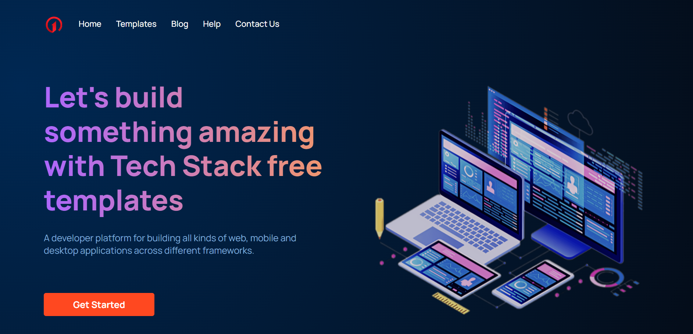
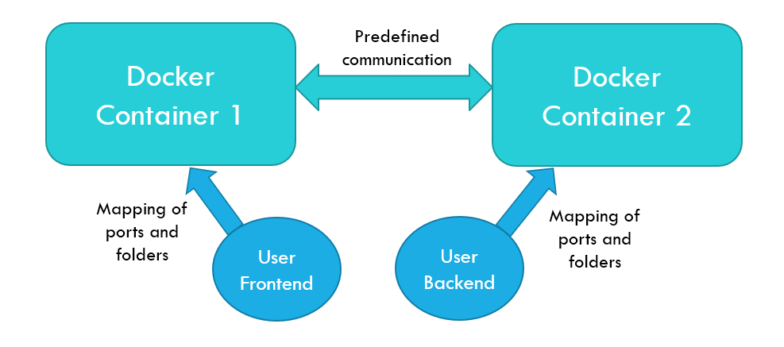
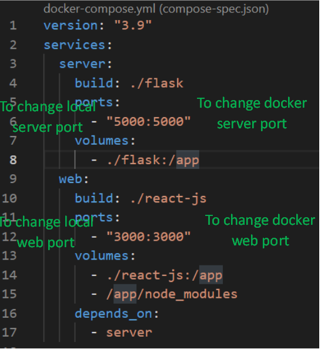

# Airbus Aerothon 4.0 (Winner)

# Tech Stack Web Application (Developed by team Teck Stack and presented in Aerothon4.0)

Tech Stack is a strong cross platform framework with modern architecture. A developer platform for building all kinds of web, mobile and desktop applications across different frameworks based on the requirement. It is a framework that help developers to kick-start their development with integrated back-end and frond-end templates. It is a fully responsive website.

## Active Pages
- Home Page
- Template Page

## Key Features
- It provides a fully customizable templates of your favourite front-end and back-end framework to start with. No need to install different libraries and dependencies, you can get here all in one.
- Be it professional or a beginner developer, no one likes a bad UI. We have made responsive, to the point user interface to interact with.
- Works on cross-platforms such as windows, macOS, Linux.

### Screenshot

 

### How it works?

The docker compose command create two docker containers to run the frontend (web) and backend (server). 

 

A container is a standard unit of software that packages up code and all its dependencies so the application runs quickly and reliably from one computing environment to another. A Docker container image is a lightweight, standalone, executable package of software that includes everything needed to run an application: code, runtime, system tools, system libraries and settings.
The web container download and install all the dependencies automatically inside the container and run the web server. To allow user to make changes in the web application, a folder of the computer is mapped with that of docker container. Also, the port of the container is mapped with the local port of the computer to examine the changes and web application developed. Similar procedure is adopted to setup the server container and is mapped with the local folder.
-	To change local port of the web server, edit the docker-compose.yml file 

 

-	To change the web framework, edit the App file under src folder in the web framework
-	To change the server framework, edit the server file under server framework

### The video-demo.mp4 file is provided to show how the developed application works.
